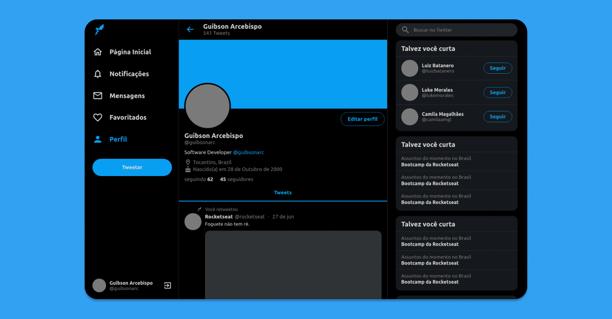

<h3 align="center">
    
</h3>

<h1 align="center">
  

  
</h1>

<h1 align="center">
    
</h1>

## :blue_book: The app

This simple <strong>[Twitter](https://twitter.com/)</strong> clone was created with the intention of gaining more knowledge about <strong>responsive design</strong> with React.js.

Responsive design contributes greatly to improving the user experience, not only with user navigation, but also in the loading of pages, which is an important point for optimization (SEO) following Google's requirements.

To achieve this result, media queries were used. A media query consists of a media type and at least one expression that limits the scope of style sheets using media features, such as width, height and color. Media queries, added in CSS3, leave the presentation of the content adapted to a specific range of devices without needing to change the content itself.

This application was built in this [video](https://www.youtube.com/watch?v=K-8z_4xvT3o) by [Rocketseat](https://rocketseat.com.br/).

View the [live demo](https://twitter-ui-clone-guibsonarc.netlify.app/):

## :computer: Technologies

- [x] [TypeScript](https://www.typescriptlang.org/)
- [x] [React.js](https://reactjs.org/)

<h1></h1>
<h4 align="center">
    Made by <a href="https://www.linkedin.com/in/guibsonarc/" target="_blank">Guibson Arcebispo</a>
</h4>